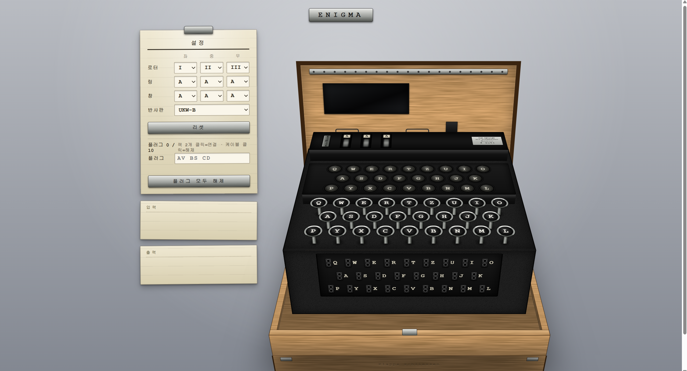

# ENIGMA-SIMULATOR

**[▶ Live Demo](https://m1k-2y.github.io/enigma-simulator/)**




## Overview

This project implements ENIGMA M3 used by german heer.

This project implements rotors selection and ordering , ring setting and window setting, plug board's setting and rotor's stepping and double stepping.

The goals of this project are 
1. Understand Enigma's structure, encryption and decrpion mechanism.
2. Become the foundation of next RSK and BOMBE projects.
3. Experience vibe coding front, UI/UX by using Claude code in terminal.

Implement core logic by using Python and  UI/UX by using javascript with claude code.

## Features

- Selection and ordering of three rotors from five available rotors.
- Selection of one reflector from two reflectors.
- Selection of each rotor's window setting and ring setting.
- Rotor stepping and double stepping.
- Plug board's pair up.
- Encrypt input letter and decrypt with same settings.
- Python implementation of the core Enigma logic.
- Interactive browser UI implemented in JavaScript.

## How Enigma works

1. Set the rotors, reflector, ring, window and plug board.

2. Input the letter.

3. Right rotor steps for each letter input.

Middle rotor steps if right rotor is in notch position.

Left rotor steps if middle rotor is in notch position.

Middle rotor also steps if middle rotor is in notch position.

It is called double stepping.

4. Letter is exchanged by plug board. 

If there is no corresponding letter pair in plug board, letter just pass.

5. Letter exchanged in each rotor. 

6. Letter exchanged by reflector in pairs of keys. 
   
Each letter does not pair with itself.

7. Letter exchanged in each rotor again by reverse ordering of rotor and inverse mapping.

8. Letter exchanged by plug board again.

If there is no corresponding letter pair in plug board, as above, letter just pass.

9. Encrypted Letter display in lamp board.

## Implement

### Python core

- stepping / double stepping

Express rotor position by global variable list named POS.

List notch position of middle and right rotor and state of middle and right rotor's.

For each input, step right rotor.

If right rotor's notch is same with right rotor's state, then step middle rotor.

If middle rotor's notch is same with middle rotor's state, then step middle and left rotor.

If middle rotor appliciable step and double stepping, it's step restricted once.

Calculate each rotor's state with mod 26.

- rotor encrypt

Calculate for what exchange by ring and window setting. 

Convert letter to number.

(converted letter number + current state of window - ring setting) mod 26

It is mapped through rotor by rotor wiring.

(converted mapped letter number - current state of window + ring setting) mod 26

Convert number to letter then return.

- reflector

Letter exchanged with paired letter in reflector.

- reverse rotor encrypt

Convert letter to number.

(converted letter number + current state of window - ring setting) mod 26

It is mapped throug rotor by inverse rotor wiring.

(converted mapped letter number - current state of window + ring setting) mod 26

- plugboard

Letters pairs can be zero to ten.

Letter exchange to pair letter in plugboard.

- full encryption flow

Input key

-> rotor step

-> plugboard

-> right rotor

-> middle rotor

-> left rotor

-> reflector

-> left rotor (inverse)

-> middle rotor (inverse)

-> right rotor (inverse)

-> plugboard

-> lampboard

### JavaScript UI

- The browser frontend was developed using Claude Code.

- I specified the desired Enigma controls, interactions, and UI/UX requirements.

- Claude Code was used to implement the JavaScript frontend and 3D visualization.

- The frontend behavior was tested against the Python implementation.

## Usage

### Python

Clone the repository and move to the project directory.

```bash
git clone https://github.com/m1k-2y/enigma-simulator.git
cd enigma-simulator
```

Run the Python version:

```bash
python -m src.main
```

To run the tests:

```bash
python -m pytest -v
```

### Browser

The browser simulator is deployed through GitHub Pages.

**Live Demo:** [Enigma Simulator](https://m1k-2y.github.io/enigma-simulator/)

You can also run it locally without a build step by opening:

```text
docs/index.html
```

On Linux:

```bash
xdg-open docs/index.html
```

Configure the rotors, reflector, ring settings, window settings, and plugboard through the browser UI.

Then press a key on the virtual keyboard and check the encrypted output on the lampboard.

## Verification

The Python core is tested using `pytest`.

### Basic Encryption Test

The simulator checks a basic Enigma configuration with:

- Rotors: I, II, III
- Ring settings: A, A, A
- Window settings: A, A, A
- Reflector: B
- Plugboard: none
- Input: `AAAAA`
- Expected output: `BDZGO`

### Custom Window Position Test

The effect of changing the rotor window positions is also tested.

- Rotors: I, II, III
- Ring settings: A, A, A
- Window settings: A, D, U
- Reflector: B
- Plugboard: none
- Input: `AAAAA`
- Expected output: `EQIBM`

### Encryption / Decryption Round-Trip Test

Enigma uses the same machine configuration for both encryption and decryption.

The round-trip test uses:

- Rotors: I, II, III
- Ring settings: A, A, A
- Window settings: A, A, A
- Reflector: B
- Plugboard pairs: `A ↔ V`, `B ↔ S`
- Plaintext: `HELLOWORLD`

The plaintext is encrypted once and the resulting ciphertext is processed again using the same settings.

The final output must be:

```text
HELLOWORLD
```

Run all tests with:

```bash
python -m pytest -v
```

## Project Structure

```text
enigma-simulator/
├──assets/
|   ├── screenshot.png
├── docs/
│   ├── core.js             # JavaScript port of the Enigma core logic
│   ├── index.html          # Entry point for the browser simulator
│   └── ui.js               # Browser UI and interaction logic
├── src/
│   ├── core.py             # Rotor, reflector, plugboard, and stepping logic
│   └── main.py             # Encryption flow and command-line interface
├── test/
│   └── test_enigma.py    # pytest tests for encryption and round-trip verification
├── .gitignore
└── README.md
```

- `src/` contains the Python implementation of the Enigma core.
- `docs/` contains the browser simulator deployed through GitHub Pages.
- `test/` contains automated tests for the Python implementation.

## Limitation / Future work

### Limitations

- The simulator currently supports only the Enigma M3.
- The project focuses on the machine's encryption mechanism and does not model historical operational procedures such as daily keys and message-key procedures.

### Future work

- RSK
- BOMBE with Go